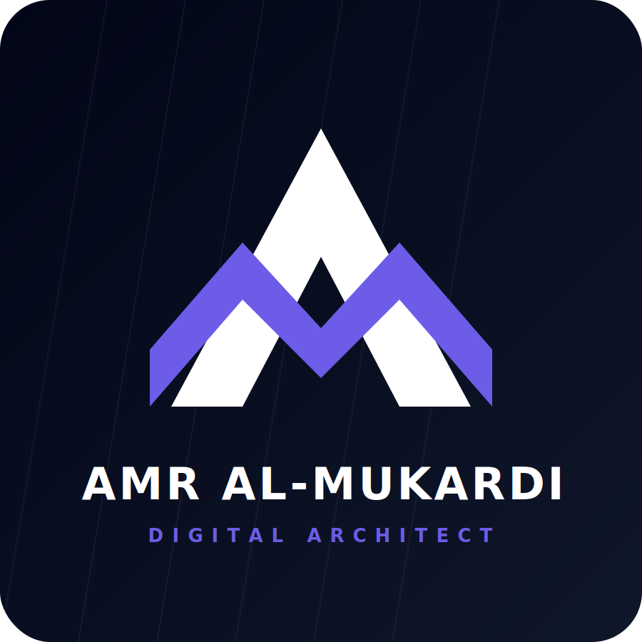

  
  
  # Amr Al-Mukardi

  ### Digital Architect | Web & Infographic Designer | Bilingual Educator
  
  
  
  
  

---

## 👋 About Me

I'm a passionate **Digital Architect** and **English Instructor** from Yemen who crafts immersive digital experiences. I combine clean code with thoughtful design to build interactive web projects, infographics, and bilingual documents.  

My multidisciplinary approach bridges the gap between **technology, design, and communication** – ensuring every project I deliver not only looks great but tells a meaningful story.

- 🌍 Based in **Yemen**
- 🧠 Multilingual: **English | Arabic**
- 🧰 Specialized in **Web Design, Infographic Design, Document Redesign & Translation**
- 🎓 Experienced **English Language Instructor**

---

## ✨ What I Do

- 🎨 **Web & Landing Page Design** – Responsive, interactive pages using HTML, CSS, and JavaScript.
- 📊 **Interactive Infographics & Presentations** – Engaging data storytelling that captures attention.
- 📄 **Document Redesign & Bilingual Translation** – Transforming reports and sheets into professional, bilingual layouts.
- 🇬🇧 **English Instruction & Curriculum Design** – Building custom learning materials and teaching with precision.

---

## 🧰 Tech Stack & Tools

---

## 🚀 Featured Projects

| Project | Description | Tech | Live Demo |
|--------|-------------|------|-----------|
| **Nura Brand** | Feminine perfume brand website with elegant responsive design. | HTML, CSS, JS | [🔗 View](https://nura-brand.vercel.app/) |
| **Landing Page** | Modern product landing page with smooth interactions. | HTML, CSS, JS | [🔗 View](https://landing-page-theta-silk-26.vercel.app/) |
| **Marketing Infographic** | Interactive data storytelling infographic. | HTML, CSS, JS | [🔗 View](https://marketing-infographic.vercel.app/) |
| **Survey** | Interactive tech survey with dynamic responses. | HTML, CSS, JS | [🔗 View](https://survey-tech-nova.vercel.app/) |
| **React Presentation 1** | Interactive slide deck built with React. | React, CSS, JS | [🔗 View](https://react-presentation-1-beta.vercel.app/) |
| **Reactive Presentation 2** | Data-driven interactive slides with dynamic charts. | HTML, CSS, JS | [🔗 View](https://reactive-presentation-2.vercel.app/) |
| **Interactive Learning** | Engaging educational content and quizzes. | HTML, CSS, JS | [🔗 View](https://interactive-learning-silk.vercel.app/) |
| **Mind Map** | Responsive marketing mind map tool. | HTML, CSS, JS | [🔗 View](https://responsive-mind-map.vercel.app/) |

> 💡 Explore all projects live on my portfolio website.

---

## 📜 Certificates & Documents

I hold **20+ certificates** in digital marketing, graphic design, freelancing, cybersecurity, and more. You can browse and download them directly from my website's [Certificates section](https://amr-mukardi-portfolio.vercel.app/#certificates).

---

## 📫 Let's Connect

- 💬 **WhatsApp Business:** [+967 737 168 038](https://wa.me/967737168038)
- 📧 **Email:** [amralmukardi@gmail.com](mailto:amralmukardi@gmail.com)
- 💼 **LinkedIn:** [linkedin.com/in/amr-mukardi](https://www.linkedin.com/in/amr-mukardi)
- 💻 **GitHub:** [github.com/amr-mukardi](https://github.com/amr-mukardi)

---

## 📂 Project Structure
amr-mukardi-portfolio/
├── index.html                # Main single-page portfolio (HTML, CSS, JS)
├── README.md
└── assets/
    ├── images/
    │   ├── brand/            # Logo, favicon, profile, OG image
    │   ├── projects-covers/  # SVG covers for the 8 projects
    │   └── before-after/     # Real before/after images + cover SVGs
    ├── downloads/
    │   └── certificates/     # PDF certificates
    └── icons/    # SVG icons (WhatsApp, GitHub, LinkedIn, Email)
    
    
---

## 🌟 Why This Portfolio?

- 🧬 **100% Handcrafted** – No templates, just pure HTML, CSS, and JavaScript.
- 🌓 **Dark & Vibrant UI** – Carefully designed purple-accented dark theme.
- 🌐 **Bilingual (EN/AR)** – Full Arabic translation available with RTL support.
- ⚡ **Performance Focused** – Built for speed and accessibility.
- ✨ **Interactive Elements** – Typewriter effect, floating particles, lightbox galleries.

---

  Crafted with 💜 and code · &lt;amr-mukardi/&gt;

